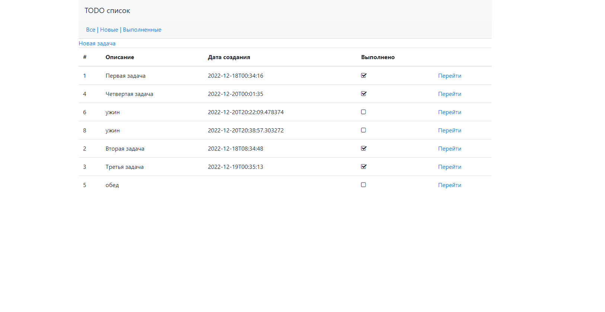

<h3>Приложение реализующее базовый функционал списка дел с базовой визуализацией.</h3>
    Данное приложение позволяет вести список дел. Для этого нам доступны такие функции как, добавление, редактирование, и изменение статуса.
<h3>Используемые технологии:</h3>
<ul>
<li>Java17</li>
<li>Spring boot 2.5.2</li>
<li>Hibernate 5.6.11</li>
<li>ThymeLeaf 2.5.2</li>
<li>Liquibase 3.6.2</li>
<li>Lombok 1.18.22</li>
<li>PostgreSQL-14</li>
<li>H2 DB 2.1.212</li>
</ul>
<h3>Для корректной работы приложения необходимо установить:</h3>
<ul>
<li>Java 16</li>
<li>Maven 3.x+</li>
<li>PostgreSQL 14.</li>
</ul>

<h3>Запуск приложения</h3>
1. Создайте базу данных "tasks" использованием командной строки или в любой платформе для администрирования PostgreSQL, например PgAdmin. 
2. Запуск приложения производится из корневого каталога проекта с использованием Maven. Необходимо выполнить следующие команды:
mvn spring-boot:run

Скриншот страницы:
